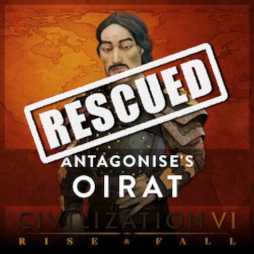

# Antagonise's Oirat Civilization (GS version)
> An updated version of "Antagonise's Oirat Civilization" mod.

**Reupload of the original mod by Antagonise.**
This is an updated version of [Antagonise's Oirat Civilization](https://steamcommunity.com/sharedfiles/filedetails/?id=1232716143]) mod. It adds the Oirat Empire as Civilization with Galdan as its leader for Civilization VI - Gathering Storm (and later).

> If you like the **Oirat Civilization** mod: please support the original creators : Antagonise and SeelingCat, chimp, Leugi, sukritact, Tino, Dray, AngelofSloths. **All credit to the original creators!**

For more detailed information about this mod please visit the Steam page of [the original mod](https://steamcommunity.com/sharedfiles/filedetails/?id=1232716143])!

**DO NOT USE TOGETHER WITH THE ORIGINAL MOD!**

---
### What has been updated?
- now compatible with GS and NFP
- needs both DLCs R&F and GS

### What has been tested?
- Ability: Dorben Oirad
- Unique Improvement: Uyangiin Ger

### What has NOT been tested?
- Unique Unit: Ulan Zalata
- Ability: Boshigt Khan
- Agenda: Subjugation of Khalkha
- AI/computer playing Oirat
- multiplayer

### Known problems
- Unique Improvement: Uyangiin Ger does not seem to provide +0.5 housing ?!

---
> If you like the **Oirat Civilization** mod: please support the original creators : Antagonise and SeelingCat, chimp, Leugi, sukritact, Tino, Dray, AngelofSloths. **All credit to the original creators!**

If you want to appreciate the time and work I put into this update:
Feel free to buy me a cup of tea on Ko-fi to help me stay awake 😉.

> But again: please support the original creators : Antagonise and SeelingCat, chimp, Leugi, sukritact, Tino, Dray, AngelofSloths. **All credit to the original creators!**
